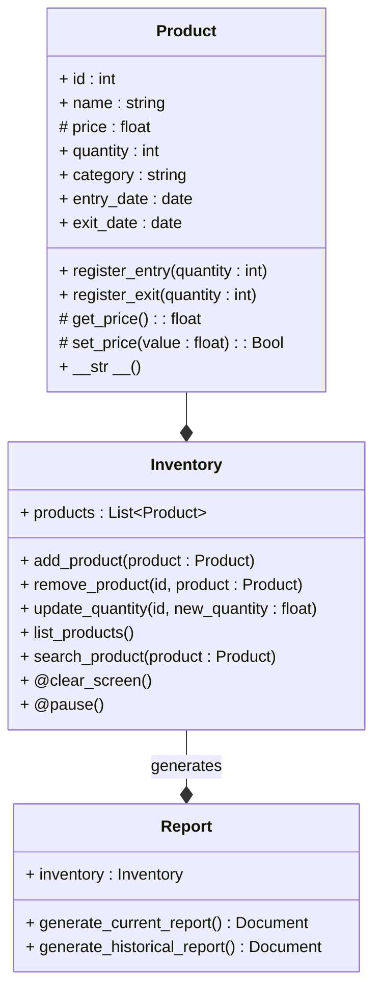

# <div align='center'> Warehouse Inventory System 📝 </div>

## <div align='center'> ✧ Team Rocket ✧ </div>
<div align='center'>
<figure> </br>
<figcaption><b></b></figcaption></figure>
</div>

### Description

We are developing an inventory manager with the knowledge learned across this semester in order to use get a useful program.
the code is pretty basic at the moment, nowadays its useful, it use two principal classes, inventory wich is composed by product

## UML Class Diagrams:


## Code preview:
```python
import os
from datetime import date

class Product:
    """
    This class represents a product with attributes such as ID, name, 
    price, and quantity

    Attributes: 
        id (int): product id.
        name (str): product name.
        price (float): product price.
        quantity (int): product quantity.
        category (str): product category
        entry_date (date): Date the product entered inventory
        exit_date (date): Date the product left inventory

    Methods:
        __str__() -> str: 
            Returns product attributes.
        register_entry(self, quantity):
            For increasing product quantity
        register_exit(self, quantity):
            For reducing product quantity
        get_price(self):
            Getter that returns product price
        set_price(self, value) -> float:
            Setter for product price
    """
    def __init__(self, id: int, name: str, price: float, quantity: int, category: str, entry_date: date, exit_date: date = None):
        self.id = id
        self.name = name
        self._price = price
        self.quantity = quantity
        self.category = category
        self.entry_date = entry_date
        self.exit_date = exit_date

    def register_entry(self, quantity: int):
        try:
            if quantity <= 0:
                raise ValueError("Quantity must be greater than 0.")
            self.quantity += quantity
            print(f"\n{quantity} units of {self.name} have been added. Total in inventory: {self.quantity}.")
        except (ValueError, TypeError) as e:
            print(f"Error: {e}")

    def register_exit(self, quantity: int):
        try:
            if quantity <= 0:
                raise ValueError("Quantity must be greater than 0.")
            if quantity > self.quantity:
                raise ValueError("Not enough units in stock.")
            self.quantity -= quantity
            print(f"\n{quantity} units of {self.name} have been removed. Total in inventory: {self.quantity}.")
        except (ValueError, TypeError) as e:
            print(f"Error: {e}")

    def get_price(self):
        return self._price

    def set_price(self, value: float):
        if value <= 0:
            raise ValueError("Price must be greater than 0.")
        self._price = value


    def __str__(self):
        exit_date_str = self.exit_date if self.exit_date else "N/A"
        return (
                f"ID: {self.id}, Name: {self.name}, Price: ${self._price:.2f}, "
                f"Quantity: {self.quantity}, Category: {self.category}, "
                f"Entry Date: {self.entry_date}, Exit Date: {exit_date_str}"
                )

class Inventory:
    """
    This class manages a collection of products in the inventory.

    Attributes: self, generates a list of products

    Methods:
        add_product(self, product: Product):
            Adds a new product to the inventory if its ID is not already in use.
        remove_product(self, product_id: int):
            Removes a product from the inventory by its ID, if found.
        list_inventory(self):
            Displays all current products in the inventory.
        search_product(self, product_id: int):
            Searches for a product by its ID and returns it if found, otherwise returns None.
        update_quantity(self, product_id: int, new_quantity: int):
            Updates the quantity of an existing product by its ID.

    """
    def __init__(self):
        self.products = []

    def add_product(self, product: Product):
        if any(p.id == product.id for p in self.products):
            print("\nThe product already exists in the inventory.")
        else:
            self.products.append(product)
            print(f"\nProduct {product.name} successfully added to inventory.")

    def remove_product(self, id: int):
        product = self.search_product(id)
        if product:
            self.products.remove(product)
            print(f"\nProduct {product.name} removed successfully from inventory.")
        else:
            print(f"\nProduct with ID {id} not found.")

    def list_inventory(self):
        print("\n=== Current Inventory ===")
        if not self.products:
            print("The inventory is empty.")
        for product in self.products:
            print(product)

    def search_product(self, id: int):
        for product in self.products:
            if product.id == id:
                return product
        print(f"\nProduct with ID {id} not found.")
        return None

    def update_quantity(self, id: int, new_quantity: int):
        try:
            product = self.search_product(id)
            if not product:
                raise ValueError(f"\nProduct with ID {id} not found.")  # Exception if the ID doesn't exists
            if new_quantity < 0:
                raise ValueError("\nQuantity cannot be negative.")  # Exception if new_quantity is negative
            product.quantity = new_quantity
            print(f"\nSuccessfully updated quantity of {product.name} to {product.quantity}.")
        except (ValueError, TypeError) as e:
            print(f"Error: {e}")

    @staticmethod
    def clear_screen():
        """Clears the console"""
        os.system("cls" if os.name == "nt" else "clear")

    @staticmethod
    def pause():
        """Pauses execution until user inputs Enter."""
        input("\nPress Enter to continue ...")
        Inventory.clear_screen()

def main():
    inventory = Inventory()
    while True:
        print("\nInventory Management\n")
        print("1. Add product")
        print("2. Remove product")
        print("3. List products")
        print("4. Search product with ID")
        print("5. Update product quantity")
        print("6. Register product ENTRY")
        print("7. Register product EXIT")        
        print("8. Exit")
        option = input("\nSelect an option: ")

        if option == "1":
            id = int(input("Enter the product ID: "))
            name = input("Enter the product name: ")
            price = float(input("Enter the product price: "))
            quantity = int(input("Enter the product quantity: "))
            category = input("Enter the product category: ")
            entry_date = input("Enter the date the product entered inventory (Format: YYYY, MM, DD), for today's date just press Enter): ")
            try:
                year_str, month_str, day_str = entry_date.split(",")
                year = int(year_str.strip())
                month = int(month_str.strip())
                day = int(day_str.strip())
                entry_date = date(year, month, day)
            except (ValueError, TypeError):
                print("\nFormato de fecha inválido. Se usará la fecha de hoy.")
                entry_date = date.today()
            product = Product(id, name, price, quantity, category, entry_date)
            inventory.add_product(product)
            Inventory.pause()

        elif option == "2":
            id = int(input("Enter the product ID to remove: "))
            inventory.remove_product(id)
            Inventory.pause()

        elif option == "3":
            inventory.list_inventory()
            Inventory.pause()

        elif option == "4":
            id = int(input("Enter the product ID to search: "))        
            inventory.search_product(id)
            if product:
                print(product)
            else:
                print(f"\nProduct with ID {id} not found.")
            Inventory.pause()

        elif option == "5":
            id = int(input("Enter the product ID to update: "))
            new_quantity = int(input("Enter the new quantity: "))
            inventory.update_quantity(id, new_quantity)   
            Inventory.pause()

        elif option == "6":
            id = int(input("Enter the product ID to register ENTRY: "))
            quantity_to_add = int(input("Enter the quantity to add: "))
            product_found = inventory.search_product(id)
            if product_found:
                product.register_entry(quantity_to_add)
            else:
                print(f"\nProduct with ID {id} not found.")
            Inventory.pause()

        elif option == "7":
            id = int(input("Enter the product ID to register EXIT: "))
            quantity_to_remove = int(input("Enter the quantity to remove: "))
            product_found = inventory.search_product(id)
            if product_found:
                product.register_exit(quantity_to_remove)
            else:
                print(f"\nProduct with ID {id} not found.")
            Inventory.pause()

        elif option == "8":
            print("\nInventory closed succesfully")
            break

        else:
            print("\nInvalid option. Please try again.")
            Inventory.pause()

if __name__ == "__main__":  
    main()
```


